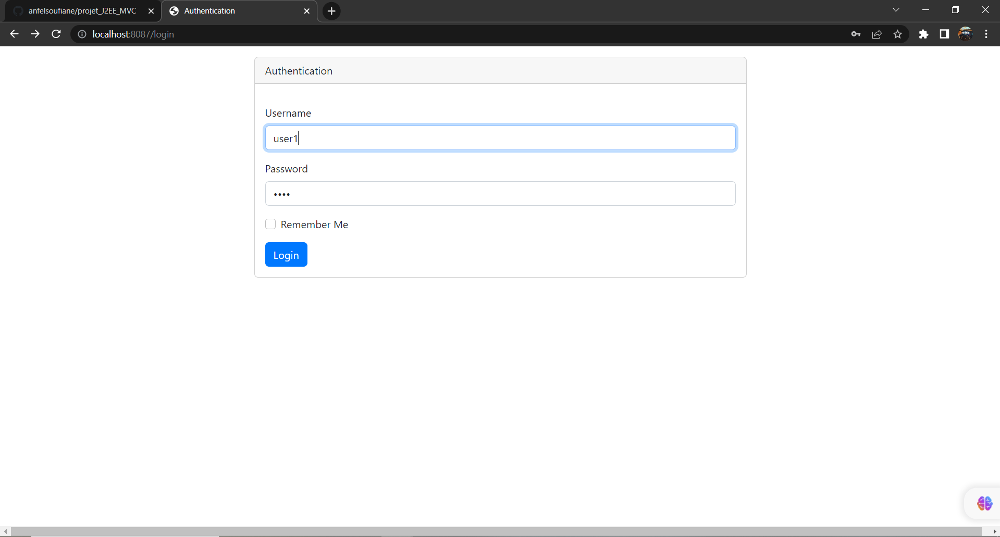

<h3>Projet géstion de patient JEE </h3>

Authentication autant que user1

home user1

Authentication user2

home user2

Authentication admin

home admin

code patient

code patient mvc

code repository

code security

code application prop

